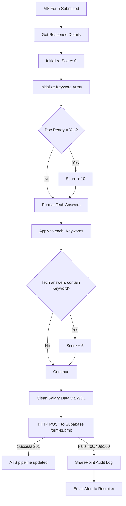

# Power Automate → Samara ATS Integration Guide

This guide provides the exact Workflow Definition Language (WDL) expressions and logical steps to connect your MS Form responses to the Samara ATS `form-submit` Edge Function.

---

## Step 1: Data Cleaning (Salary)

MS Form salary inputs are incredibly messy strings (e.g., "Rp 9.000.000", "IDR 7,000,000", "13-14 mil"). The ATS requires an integer (e.g., `9000000`). 

To clean this safely in Power Automate without premium expressions or complex regex, use a nested `replace()` chain that strips common non-numeric characters, followed by an `int()` cast. If the result is unparseable or empty, we default to `0`.

**Create a "Compose" action named `CleanCurrentSalary`:**

```wdl
if(
  empty(outputs('Get_response_details')?['body/rXXXX_CurrentSalary']), 
  0,
  if(
    isFloat(replace(replace(replace(replace(replace(toLower(outputs('Get_response_details')?['body/rXXXX_CurrentSalary']), 'rp', ''), 'idr', ''), '.', ''), ',', ''), ' ', '')),
    int(replace(replace(replace(replace(replace(toLower(outputs('Get_response_details')?['body/rXXXX_CurrentSalary']), 'rp', ''), 'idr', ''), '.', ''), ',', ''), ' ', '')),
    0
  )
)
```

*(Repeat this exact pattern for a `CleanExpectedSalary` Compose action, replacing the dynamic content reference `rXXXX` with your Expected Salary question ID).*

> [!TIP]
> **How to find your exact `rXXXX` ID:** Hover over the dynamic content token in Power Automate and look at the tooltip, or click "Peek code" on the action.

---

## Step 2: Keyword Scoring & Variables

Create your variables at the top of the flow.

1. **Initialize variable** — `CandidateScore` (Type: Float, Value: 0)
2. **Initialize variable** — `RoleKeywords` (Type: Array)
   *Value example (Geotech):* `["Sondir", "Pile", "CPT", "Geoteknik"]`
   *Value example (Accountant):* `["Consolidation", "Xero", "Tax", "PSAK"]`

### Document Readiness (10 points)
Add a **Condition** action immediately after you initialize the variables:
- **Left:** `outputs('Get_response_details')?['body/rXXXX_DocumentReadiness']`
- **Operator:** `is equal to`
- **Right:** `Yes`
- **If Yes:** Add an `Increment variable` action to increase `CandidateScore` by `10`.

### Technical Answers Formatting
To combine multiple technical answers into one block before scoring them:
Create a **Compose** action named `CombinedTechnicalNotes` and concatenate the responses:
```text
Question 1 Answer:
@{outputs('Get_response_details')?['body/rXXXX_TechQ1']}

Question 2 Answer:
@{outputs('Get_response_details')?['body/rXXXX_TechQ2']}
```

### Keyword Scoring (5 points per keyword)
1. Add an **"Apply to each"** loop.
2. Select output from previous steps: `variables('RoleKeywords')`
3. Inside the loop, add a **Condition**:
   - **Left:** `toLower(outputs('CombinedTechnicalNotes'))`
   - **Operator:** `contains`
   - **Right:** `toLower(items('Apply_to_each'))`
4. **If Yes:** Add an `Increment variable` action to increase `CandidateScore` by `5`.

---

## Step 3: API Payload to ATS

Add an **HTTP** action to POST the candidate to the new Edge Function.

- **Method:** `POST`
- **URI:** `https://<YOUR_SUPABASE_PROJECT_REF>.supabase.co/functions/v1/form-submit`
- **Headers:**
  - `Content-Type`: `application/json`
  - `Authorization`: `Bearer <YOUR_SUPABASE_SERVICE_ROLE_KEY>`
- **Body:**

```json
{
  "role_id": "c73f8b91-...", 
  "tenant_id": "a92c4f82-...",
  "full_name": "@{outputs('Get_response_details')?['body/rXXXX_FullName']}",
  "email": "@{outputs('Get_response_details')?['body/rXXXX_Email']}",
  "whatsapp": "@{outputs('Get_response_details')?['body/rXXXX_WhatsApp']}",
  "origin": "@{outputs('Get_response_details')?['body/rXXXX_Origin']}",
  "current_salary": @{outputs('CleanCurrentSalary')},
  "expected_salary": @{outputs('CleanExpectedSalary')},
  "availability_to_start": "@{outputs('Get_response_details')?['body/rXXXX_Availability']}",
  "document_readiness": true,
  "technical_notes": "@{outputs('CombinedTechnicalNotes')}",
  "suitability_score": @{variables('CandidateScore')}
}
```
*(Replace `role_id` and `tenant_id` with the actual UUIDs from your ATS database).*

---

## Step 4: Error Handling & Auditing

Instead of failing silently if the ATS rejects the payload (e.g., due to duplicate emails), handle it gracefully.

1. Immediately after the **HTTP POST** action, add a **SharePoint "Create Item"** action.
2. Configure the SharePoint action's **"Configure run after"** settings (accessible via the three dots `...` menu on the action).
   - Uncheck "is successful".
   - Check **"has failed"**, **"is skipped"**, and **"has timed out"**.
3. In this SharePoint action, log the `full_name`, `email`, and the exact HTTP error code: `@{outputs('HTTP')['statusCode']}`.
4. Add a **"Send an email (V2)"** action immediately after the SharePoint action, so you get pinged about the rejected application.

## System Architecture Diagram


